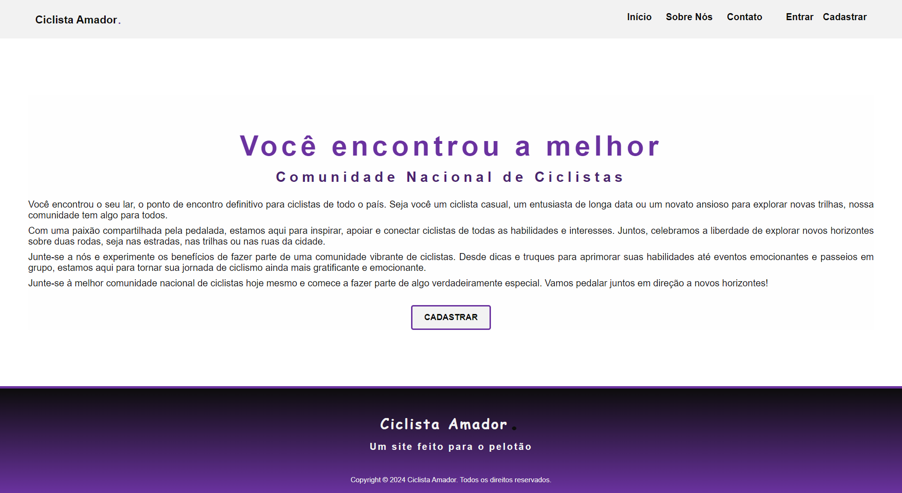

<div align="center" style="display: inline_block;">
    <a href="https://laravel.com" title="Site oficial Laravel" target="_blank" rel='noopener noreferrer'>
        
    </a>
</div>

<div align="center" style="display: inline_block;">
    <a href="https://developer.mozilla.org/pt-BR/docs/Web/HTML" title="HTML | MDN" target="_blank" rel='noopener noreferrer'>
        
    </a>&nbsp;&nbsp;
    <a href="https://developer.mozilla.org/pt-BR/docs/Web/CSS" title="CSS | MDN" target="_blank" rel='noopener noreferrer'>   
        
    </a>&nbsp;&nbsp;
    <a href="https://developer.mozilla.org/pt-BR/docs/Web/JavaScript" title="JavaScript | MDN" target="_blank" rel='noopener noreferrer'>    
        
    </a>&nbsp;&nbsp;&nbsp;&nbsp;
    <a href="https://www.php.net/docs.php" title="PHP | DOC" target="_blank" rel='noopener noreferrer'>    
        
    </a>&nbsp;&nbsp;
    <a href="https://getcomposer.org/doc/" title="Composer | DOC" target="_blank" rel='noopener noreferrer'>    
        
    </a>&nbsp;&nbsp;
    <a href="https://dev.mysql.com/doc/" title="MySQL | DOC" target="_blank" rel='noopener noreferrer'>    
        
    </a>
</div><br />

<div align="center">
<h1>PROJETO LARAVEL DE ROTAS E PÁGINAS</h1>
</div><br />

Este projeto Laravel foi desenvolvido como parte de uma atividade para criar rotas e páginas. O objetivo é criar um aplicativo web simples com três seções principais: Página Principal, Sobre Nós e Contato.

## Visão Geral do Projeto

O projeto visa estabelecer uma estrutura básica para um aplicativo web usando o framework Laravel. Ele inclui a configuração inicial do Laravel, definição de rotas para cada seção e criação de visualizações básicas para cada página.

## Pré-requisitos

- PHP instalado na sua estação de trabalho.
- Ambiente de desenvolvimento local ligado (MAMP, WAMP, XAMPP, Docker, entre outros).
- Composer instalado.

## Observação

É de livre escolha, a opção de instalar o composer global ou local.

- **Global:** Quando o Composer é instalado globalmente no sistema, significa que ele está disponível em todo o sistema e pode ser executado de qualquer diretório no terminal ou prompt de comando. As dependências globais do Composer, como pacotes ou ferramentas, são instaladas em um local acessível em todo o sistema e podem ser compartilhadas entre vários projetos.
- **Local:** Quando o Composer é usado localmente, significa que ele é instalado em um projeto específico e as dependências são gerenciadas apenas para esse projeto. Isso geralmente é feito instalando o Composer em um diretório específico dentro do projeto e executando o Composer dentro desse diretório. Isso cria um ambiente isolado para o projeto, onde as dependências são instaladas localmente e não interferem com outros projetos.

Em resumo, a diferença entre global e local no contexto do Composer é onde o Composer está instalado e como ele gerencia as dependências do projeto: globalmente para todo o sistema ou localmente para um projeto específico.

## Criação de um Novo Projeto Laravel

Para começar, crie um novo projeto Laravel executando os seguintes comandos no terminal:

**Instale o Laravel usando o Composer.**
```bash
composer create-project laravel/laravel nome-do-seu-projeto
```

**Navegue até o diretório do seu projeto recém-criado.**
```bash
cd nome-do-seu-projeto
```

## Instalação de Laravel Breeze

Dentro do diretório do seu projeto Laravel, execute o seguinte comando para instalar o Laravel Breeze:

```bash
composer require laravel/breeze --dev
```

## Configuração da Autenticação

Após a instalação do Laravel Breeze, execute os seguintes comandos para configurar a autenticação:

**Instale as views e rotas necessárias para autenticação.**
```bash
php artisan breeze:install
```

**Execute as migrações para criar as tabelas de banco de dados necessárias.**
```bash
php artisan migrate
```

## Configuração do Front-End

Para acessar e interagir com o aplicativo no navegador é necessário que o front-end esteja em execução. Portanto abra outro terminal dentro do diretório do seu projeto Laravel e execute os seguintes comandos:

**Isso instalará todas as dependências JavaScript necessárias para o seu projeto Laravel.**
```bash
npm install
```

**Isso compilará os recursos frontend, como arquivos JavaScript e CSS, para que seu aplicativo possa usá-los corretamente.**
```bash
npm run dev
```

## Inicialização do Servidor Local

Para visualizar o aplicativo em execução, inicie o servidor local executando o seguinte comando no terminal dentro do diretório do seu projeto Laravel:

```bash
php artisan serve
```

## Acessar o Aplicativo

Após inicializar o servidor local, copie ou clique no endereço http disponibilizado, e abra seu navegador para acessar as páginas de login e registro.

## Criação do Controlador no Laravel

Este controlador será salvo no diretório app/Http/Controllers e será utilizado para definir a lógica de manipulação das requisições relacionadas as páginas do seu aplicativo web.

**Criação do Controlador da página Principal.**
```bash
php artisan make:controller PrincipalController
```

**Conteúdo do PrincipalController.php.**
```php
<?php

namespace App\Http\Controllers;

use App\Http\Controllers\Controller;

class PrincipalController extends Controller {
    public function principal(){
        return view('site.principal');
    }
}
```

**Criação do Controlador da página Sobre Nós.**
```bash
php artisan make:controller SobreNosController
```

**Criação do Controlador da página Contato.**
```bash
php artisan make:controller ContatoController
```

## Criação de rotas

Adicione as rotas para as páginas desejadas dentro do diretório routes/web.php.

```php
<?php

use Illuminate\Support\Facades\Route;

Route::get('/', 'App\Http\Controllers\PrincipalController@principal')->name('site.index');
```

## Listar rotas

**Lista todas as rotas registradas na aplicação.**
```bash
php artisan route:list
```

## Criação do diretório site dentro do diretório resources/views

O diretório servirá para conter os arquivos:
- principal.blade.php
- sobrenos.blade.php
- contato.blade.php

Adicione o conteúdo HTML desejado em cada arquivo Blade para definir o layout das páginas.

```html
<!DOCTYPE html>
<html lang="pt-br">

<head>
    <meta charset="UTF-8">
    <meta http-equiv="X-UA-Compatible" content="IE-edge">
    <meta name="viewport" content="width=device-width, initial-scale=1.0">
    <title>Rotas e Links</title>
</head>

<body>
    <h1>Você encontrou a melhor</h1>

    <h2>Comunidade Nacional de Ciclistas</h2>

    <p>Você encontrou o seu lar, o ponto de encontro definitivo para ciclistas de todo o país. Seja você um ciclista casual, um entusiasta de longa data ou um novato ansioso para explorar novas trilhas, nossa comunidade tem algo para todos.
    </p>
</body>
</html>
```

## Estrutura de Arquivos

- **app:** Este diretório contém as classes do aplicativo. Aqui você encontrará os controllers, models, middlewares e outros componentes do Laravel que compõem a lógica de negócios do seu aplicativo.

- **config:** Neste diretório estão armazenados os arquivos de configuração do Laravel. Aqui você pode configurar diversos aspectos do framework e do seu aplicativo, como conexões de banco de dados, serviços, sessões, cache, entre outros.

- **database:** Este diretório contém as migrações e seeds do banco de dados. As migrações são usadas para criar e modificar a estrutura do banco de dados de forma controlada, enquanto as seeds são usadas para popular o banco de dados com dados de teste.

- **routes:** Aqui ficam os arquivos de definição de rotas do Laravel. As rotas determinam como as URLs do seu aplicativo são mapeadas para os controllers e métodos correspondentes. Você pode definir rotas para diferentes ações do seu aplicativo, como exibir uma página, processar um formulário ou executar uma API.

- **resources/views/:** Este diretório contém os arquivos de visualização do Blade, que são usados para criar a interface do usuário do seu aplicativo. O Blade é um mecanismo de template simples e poderoso fornecido pelo Laravel, que permite que você crie facilmente layouts reutilizáveis e dinâmicos.

- **public:** Aqui estão localizados os arquivos acessíveis publicamente, como CSS, JavaScript, imagens e outros recursos estáticos. Este é o diretório raiz do seu aplicativo quando acessado pelo navegador e é usado para armazenar todos os arquivos que podem ser acessados diretamente pelo cliente, sem passar pelo roteador do framework.

Essa estrutura de arquivos do Laravel ajuda a manter o projeto organizado e facilita a localização de arquivos específicos durante o desenvolvimento e a manutenção do aplicativo.

## Ilustração da página início 



## Licença

Este projeto está licenciado sob a [MIT license](https://opensource.org/licenses/MIT).
